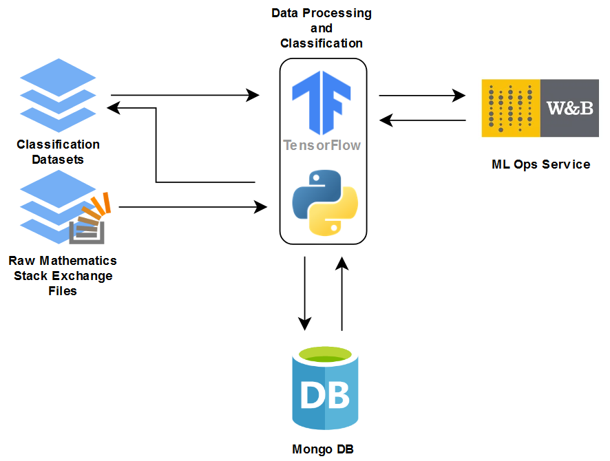

### Formula Classification and Mathematical Token Embeddings

## Technical architecture

## Contents:

* overview.ipynb - A general overview of the MSE dataset and an intermediate analysis of the semantic math extraction procedure (it makes use of overview_func.py and /images)
* utils.py - a script with preprocessing methods that were used to process the large XML file which included the initial datset
* apply.py - a file that is used to execute data processing procedures
* funcs.py - includes most data processing methods and database queries for processing and analysis
* mse_db.py - contains the MSE_DB class, which sets up the database connection and provides a useful interface for applying 
  data processing functions from funcs.py to particular subsets of data
* sem_math module:
    - math_types.py - includes the FormulaContextType and FormulaType classes 
    - post-thread.py - the PostThread class encapsulates a postThread database entry and facilitates formula extraction 
    - comparer.py - the Comparer class includes the arbitration mechanism which helps to assign a semantic type to a formula
    - /tests - includes unit tests for the FormulaType class methods
    - /grammar - contains .lark files with formula parser grammar rules
* classification_formulas_binary - contains different binary classification variations that are used to train formula embeddings
* classification_formulas_multilabel - contains different multi-label classification variations that are used to train formula embeddings